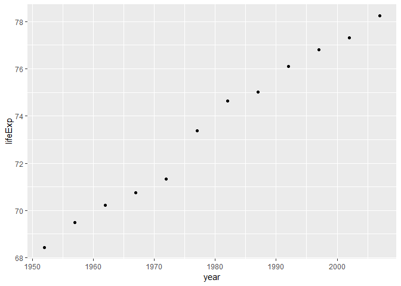

## Load packages


```r
library(tidyverse)
```

## Load data


```r
gap <- read_csv("https://bit.ly/gap_data_upd")
```

## Exercises

### Exercise 1

Take a glimpse at the data set with function `glimpse()`.


```r
glimpse(gap)
```

```
## Observations: 1,704
## Variables: 6
## $ country   <chr> "Algeria", "Algeria", "Algeria", "Algeria", "Algeria...
## $ continent <chr> "Africa", "Africa", "Africa", "Africa", "Africa", "A...
## $ year      <dbl> 1952, 1957, 1962, 1967, 1972, 1977, 1982, 1987, 1992...
## $ lifeExp   <dbl> 43.077, 45.685, 48.303, 51.407, 54.518, 58.014, 61.3...
## $ pop       <dbl> 9279525, 10270856, 11000948, 12760499, 14760787, 171...
## $ gdpPercap <dbl> 2449.008, 3013.976, 2550.817, 3246.992, 4182.664, 49...
```

How many variables and observations are in `gap`? What are the variable types
for the variables in `gap`?

Variable | Type
---------|----------
Var 1    |
Var 2    |
Var 3    |
Var 4    |
Var 5    |
Var 6    |


### Exercise 2

#### Part 1

Create a plot of life expectancy versus year for the United States.


```r
gap_usa <- gap %>% 
  filter(country == "United States")

ggplot(data = gap_usa, mapping = aes(x = year, y = lifeExp)) +
  geom_point()
```

<!-- -->

#### Part 2

Create a plot of life expectancy verses GDP per Capita for Canada. Set the
color of the points to be red.


```r
# create plot here
```

#### Part 3

Create a plot of life expectancy versus GDP per Capita based on all countries
in Africa in 1992. Set the color to be purple.


```r
# create plot here
```


### Exercise 3

#### Part 1

Create a plot of life expectancy versus GDP per Capita based on all the
countries in Africa and Europe in 1992. Set the point colors to code for the
two continents.


```r
# Create plot here
```

#### Part 2

Create comparison boxplots by continent of GDP per Capita for the year 2007.
Fill the boxplots with color `darkgreen`.


```r
# Create plot here
```


